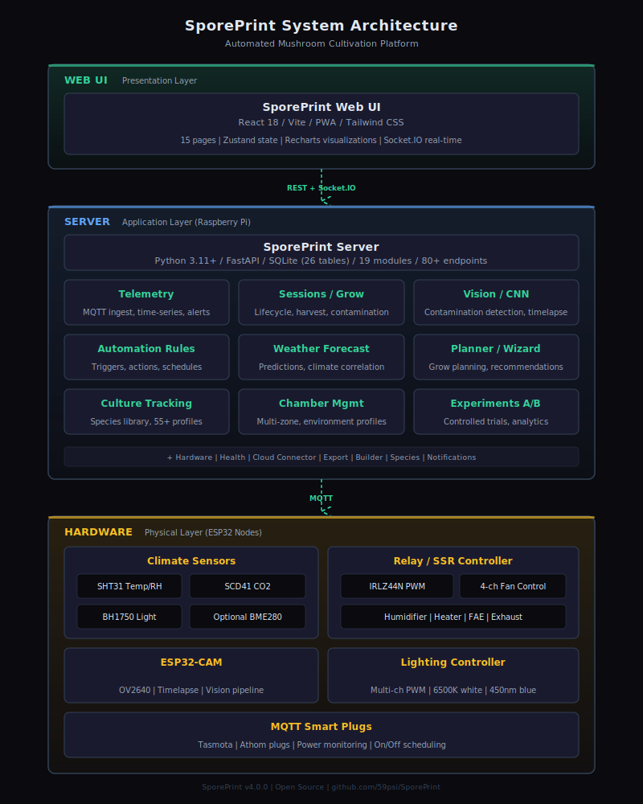
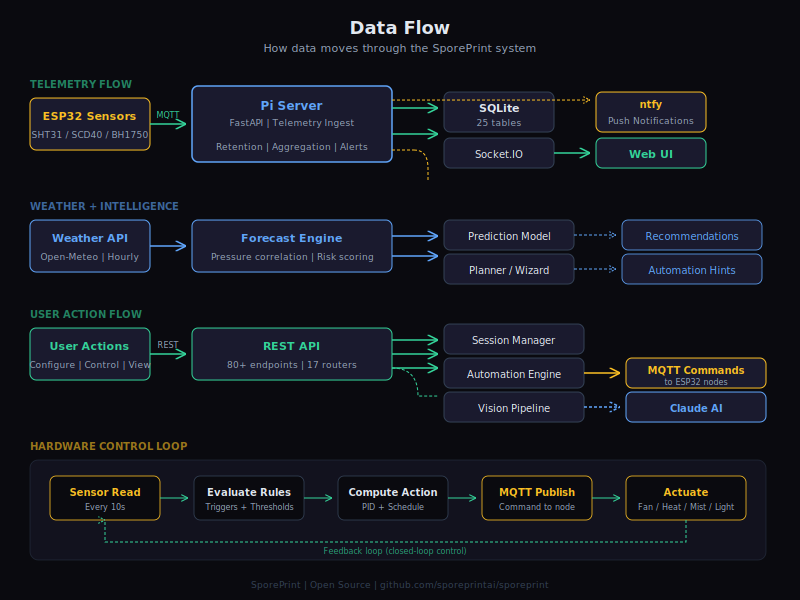

<p align="center">
  
</p>

<h1 align="center">SporePrint</h1>

<p align="center">
  <strong>Open-source automated mushroom cultivation platform</strong><br>
  Full environmental automation, 55 species profiles, AI-powered vision analysis,<br>
  weather-predictive intelligence, and a real-time React dashboard -- all running on a Raspberry Pi.
</p>

<p align="center">
  <a href="#quick-start">Quick Start</a> &bull;
  <a href="#features">Features</a> &bull;
  <a href="#architecture">Architecture</a> &bull;
  <a href="#species-library">Species Library</a> &bull;
  <a href="#api-reference">API Reference</a> &bull;
  <a href="#hardware">Hardware</a> &bull;
  <a href="#contributing">Contributing</a>
</p>

<p align="center">
  
  
  
  
  
</p>

---

> ## ⚠️ Upgrading to v3.3.1 — BREAKING: cloud relay must upgrade in lockstep
>
> **v3.3.1 Pi refuses unsigned cloud commands.** The cloud relay now HMAC-signs every command frame; the Pi verifies before executing. Consequences:
>
> - **v3.3.1 Pi paired to v3.3.0 cloud**: every mobile-app command fails with `Signature check failed: missing signature`. Remote control is fully broken until the cloud is also at v3.3.1.
> - **v3.3.0 Pi paired to v3.3.1 cloud**: commands still execute but nothing is cryptographically protected — upgrade the Pi the same day.
>
> The shared HMAC key is the already-provisioned `device_token` from pairing — no new operator secret. There is no opt-out flag. Coordinate both deploys.
>
> ## ⚠️ Upgrading to v3.3.0 — required migration steps (still apply for fresh v3.3.1 installs)
>
> **v3.3.0 was a breaking security release.** If you are upgrading an existing Pi from v3.2.x or earlier, do all three of these **before** starting the stack, or your system will not come back up:
>
> 1. **Run `./setup.sh` on the Pi.** It auto-generates `SPOREPRINT_API_KEY` and the Mosquitto `server` credential into `.env`, and provisions the broker `passwd` file. Nothing is overwritten — blank values only.
> 2. **Add MQTT credentials to every firmware node before flashing v3.3.0+ firmware.** The broker is now `allow_anonymous false`. Set `mqtt_user` and `mqtt_pass` in NVS via the captive portal (first-boot AP) or `ConfigStore`. Nodes without credentials will fail to connect.
> 3. **Set a non-default OTA password on every node.** `OTAManager::begin` refuses to start when `ota_pass` is empty or equals the legacy default `"sporeprint"`. The node stays online but cannot receive OTA updates until the operator sets a strong password via the captive portal.
>
> Details and rationale for every change are in [CHANGELOG.md](./CHANGELOG.md). The [Security](#security) section below describes the new bearer-token gate, MQTT auth, pairing handshake, and command-channel HMAC.

---

## What is SporePrint?

SporePrint turns a Raspberry Pi and a handful of ESP32 sensor nodes into a fully automated mushroom cultivation system. It monitors temperature, humidity, CO2, and light in real time, runs a declarative automation engine to control fans, lights, and smart plugs, and uses weather-predictive intelligence to anticipate environmental changes up to 72 hours in advance.

Whether you are growing oyster mushrooms in a closet or managing multiple fruiting chambers, SporePrint provides the tools to track every grow from inoculation to harvest -- with species-specific guidance, AI-powered contamination detection, and detailed analytics.

### Key Highlights

- **55 built-in species profiles** (19 active, 24 gourmet, 7 medicinal, 5 novelty) with per-phase environmental targets, TEK guides, substrate recipes, and photo references
- **17 server modules** with 80+ API endpoints across 17 router groups
- **15 UI pages** -- real-time dashboard, session manager, species library, grow planner, contamination guide, culture tracker, experiment mode, settings, and more
- **26 SQLite tables** with tiered data retention (~120 MB/year)
- **Dual vision pipeline** -- local CNN for fast contamination detection, Claude API for deep morphology analysis
- **Weather multi-provider failover** -- automatic fallback across Open-Meteo, OpenWeatherMap, and NWS; configurable from Settings UI
- **Weather-predictive alerts** up to 72 hours in advance
- **Unit preferences** -- Fahrenheit/Celsius, grams/ounces throughout the UI
- **8 OpenSCAD 3D-printable enclosure models** -- parametric designs for sensor mounts, ESP32 cases, Pi case, and more
- **8 SVG diagrams** -- color-coded wiring diagrams per hardware tier plus architecture overviews

---

## Quick Start

### One-command install on a Raspberry Pi (recommended)

SSH into a freshly-imaged Raspberry Pi (64-bit Raspberry Pi OS, Ubuntu Server,
or Debian 12+) and run:

```bash
curl -fsSL https://raw.githubusercontent.com/59psi/SporePrint/main/scripts/setup-pi.sh | bash
```

`scripts/setup-pi.sh` is idempotent — it:

1. Installs Docker Engine + the Compose plugin (via `get.docker.com`) if not already present
2. Clones the SporePrint repo into `~/SporePrint` (or pulls latest if it already exists)
3. Seeds a `.env` from the template (weather lat/lon blank — fill in after)
4. Builds the stack and brings it up with `docker compose up -d --build`
5. Prints next steps, the Pi's LAN URLs, and common ops commands

Re-run the same one-liner any time to pull updates and rebuild.

After it finishes:

- Dashboard: `http://<pi-ip>:3001` (or `http://sporeprint.local:3001` if mDNS works)
- Generate a 6-digit pairing code in Settings → Cloud Pairing, then pair from the mobile app

### Manual Docker Compose

```bash
git clone --recurse-submodules https://github.com/59psi/SporePrint.git
cd SporePrint
cp .env.example .env     # edit weather lat/lon
docker compose up -d
```

Services:
- **UI**: http://localhost:3001
- **API**: http://localhost:8000
- **MQTT**: localhost:1883 (ESP32 nodes connect here)
- **ntfy**: http://localhost:8080 (free-tier push fallback)

### Manual Development Setup

```bash
# Backend
cd server && python -m venv .venv && source .venv/bin/activate
pip install -e ".[dev]"
cp .env.example .env    # edit with your settings
uvicorn app.main:socket_app --reload

# Frontend (separate terminal)
cd ui && npm install && npm run dev

# MQTT broker (separate terminal, or use Docker)
docker run -d -p 1883:1883 -p 9001:9001 eclipse-mosquitto:2
```

### ESP32 Firmware

Once the Pi is running, open the Builder page (`http://<pi-ip>:3001/builder`)
and scroll to **ESP32 Firmware**. Each node (`climate_node`, `relay_node`,
`lighting_node`, `cam_node`) has a **ZIP** button that downloads a
self-contained PlatformIO project. Unzip, then flash with:

```bash
cd firmware
pio run -t upload -e climate_node   # or relay_node / lighting_node / cam_node
```

Or clone the repo and flash from `firmware/` directly — the ZIP bundle is
equivalent to `firmware/src/<node>/ + firmware/lib/sporeprint_common/ +
firmware/platformio.ini`.

### Prerequisites

Only needed for manual dev — `scripts/setup-pi.sh` handles everything on a Pi.

- Python 3.11+
- Node.js 20+
- Docker and Docker Compose (for production deployment)
- PlatformIO Core (for ESP32 firmware — `pip install platformio`)

---

## Features

### Environmental Monitoring and Automation

- **Real-time telemetry** -- temperature, humidity, CO2, and light from ESP32 sensor nodes via MQTT
- **Declarative rules engine** -- threshold, schedule, and compound conditions with species-aware targets and per-chamber scoping
- **Weather-aware virtual sensors** -- the system learns the correlation between outdoor weather and indoor conditions over time
- **Multi-provider weather failover** -- automatic fallback chain (Open-Meteo, OpenWeatherMap, NWS) when primary provider fails; configurable from the Settings UI
- **Predictive alerts** -- warns up to 72 hours ahead when species targets will be violated based on weather forecasts
- **Smart plug integration** -- Shelly and Tasmota device control via MQTT
- **Tiered data retention** -- raw (7 days), 5-min averages (30 days), hourly (1 year), daily (forever); ~120 MB/year on Pi

### Grow Session Management

- **Full lifecycle tracking** -- inoculation through harvest with phase transitions and location tracking (tub, shelf, side)
- **Yield statistics** -- per-session biological efficiency and yield-per-gram calculations
- **Drying tracker** -- per-harvest drying log with weight tracking over time and cracker-dry notification
- **PDF grow reports** -- comprehensive session reports with dark-themed charts for download or print
- **iCal calendar feed** -- subscribe in Google Calendar or Apple Calendar for session milestones and phase reminders
- **Session transcripts** -- structured JSON and narrative markdown exports with Claude analysis scoring

### Species Library (55 profiles)

- **Per-phase environmental targets** -- temperature, humidity, CO2, light, and FAE for every grow phase
- **TEK guides** -- step-by-step cultivation instructions from agar to harvest
- **Substrate recipes** -- species-specific formulations with ingredient ratios
- **Photo references** -- visual guides for identifying healthy growth stages
- **Contamination risk data** -- species-specific susceptibilities and prevention strategies
- **Regional growing notes** -- climate-specific tips
- **Species Selector Wizard** -- guided 6-step questionnaire with weighted scoring to recommend species for your setup and experience level
- **Substrate Calculator** -- volume-based recipe scaling for custom container dimensions
- **Shopping List Generator** -- itemized supply lists with quantities and supplier links

### Seasonal Grow Planner

- **Weather-based species recommendations** -- scores species against local climate history to find what grows best in your area right now
- **Grow calendar** -- monthly view of species compatibility per season
- **Session warnings** -- alerts for active sessions when unfavorable conditions are forecast
- **iCal export** -- add your grow calendar to any calendar app

### Contamination Library

- **7 contaminant profiles** -- trichoderma, cobweb mold, black mold, bacterial blotch, lipstick mold, wet spot, and more
- **Symptoms and treatment protocols** -- identification guides with recommended responses
- **Claude Vision identification** -- upload a photo of suspected contamination for AI analysis

### Culture and Genetics Tracking

- **Lineage tree visualization** -- trace genetics from spore print through agar, liquid culture, grain, and bulk
- **Generation counting** -- automatic generation tracking with parent/child relationships
- **Transfer logs** -- record every transfer with date, source, destination, and notes
- **Contamination rate per lineage** -- identify clean vs. problematic genetics
- **Spore print and clone tracking** -- log spore prints, tissue clones, and liquid culture with source metadata

### Multi-Chamber Management

- **Named chamber profiles** -- independent environment targets per chamber
- **Node assignment** -- assign ESP32 nodes to specific chambers
- **Per-chamber automation** -- rules scoped to individual chambers
- **Comparison view** -- side-by-side chamber metrics for optimization

### A/B Experiment Mode

- **Controlled experiments** -- compare conditions, substrates, or species across paired sessions
- **Side-by-side telemetry** -- real-time charts for control vs. variant
- **Automated comparison reports** -- percent difference per metric at experiment completion
- **Optional AI analysis** -- Claude-powered interpretation of experiment results

### QR Code Labels

- **Session labels** -- QR codes with embedded session metadata for jars, bags, and tubs
- **Culture labels** -- track genetics containers with scannable codes
- **Thermal printer support** -- sized for Phomemo, NIIMBOT, Brother, and Dymo label printers

### Vision Pipeline

- **Local CNN** -- fast contamination detection on ~15-minute cycle
- **Claude Vision API** -- deep morphology analysis with species-specific context
- **Camera module** -- ESP32-CAM MJPEG streaming with frame capture

### Hardware Builder

- **3 hardware tiers** -- Bare Bones (~$100), Recommended (~$200), All the Things (~$350+)
- **Shopping lists** -- complete parts lists with purchase links
- **Wiring diagrams** -- color-coded SVG diagrams for each tier
- **Step-by-step assembly** -- guides for building sensor and actuator nodes
- **Claude assistant** -- AI-powered answers to custom hardware questions

### Notifications

- **3-tier ntfy alerts** -- critical (immediate), warning (5-min dedup), info (hourly batch)
- **Weather-predictive notifications** -- alerts up to 72 hours before conditions deteriorate
- **Configurable topics** -- route alerts by category

### System Health

- **Pi system metrics** -- CPU, memory, disk, temperature via psutil
- **MQTT broker stats** -- connection counts, message rates
- **Socket.IO client tracking** -- active WebSocket connections
- **Background task registry** -- status of MQTT, weather polling, retention, cloud connector

### Unit Preferences

- **Temperature** -- switch between Fahrenheit and Celsius throughout the UI
- **Weight** -- switch between grams and ounces for harvest tracking and yield display

---

## Architecture




```
ESP32 Nodes ──MQTT──> Raspberry Pi Backend <──REST/WS──> React UI
  (sensors,            (FastAPI, SQLite,                  (dashboard,
   relays,              17 modules, 80+ endpoints,         15 pages,
   lighting,            26 tables, automation engine,       real-time
   camera)              weather failover,                   WebSocket)
                        ntfy notifications)
```

**Hardware layer**: ESP32 sensor/actuator nodes (climate, relay/SSR, lighting, camera) plus Shelly/Tasmota smart plugs, all communicating via MQTT. A 3-tier hardware builder provides shopping lists and wiring diagrams.

**Backend**: FastAPI on Raspberry Pi 4/5. SQLite with tiered retention. Mosquitto MQTT broker. Declarative automation rules engine with weather-aware virtual sensors. Dual vision pipeline (local CNN + Claude API). Predictive model learns weather-to-closet correlation. ntfy push notifications with predictive alerts.

**Frontend**: React 18 + TypeScript + Vite + Tailwind CSS v4. Real-time WebSocket updates. 7-day forecast with grow impact analysis. PWA-capable. Dark theme with species category accent colors.

### Project Structure

```
SporePrint/
├── firmware/                  # ESP32 PlatformIO monorepo
│   ├── lib/sporeprint_common/ # Shared: WiFi, MQTT, OTA, heartbeat, offline buffer, health reporter
│   └── src/
│       ├── climate_node/      # SHT31, SCD40, BH1750 sensors
│       ├── relay_node/        # IRLZ44N SSR control (4ch PWM)
│       ├── lighting_node/     # Multi-channel LED (white, blue, red, far-red)
│       └── cam_node/          # ESP32-CAM MJPEG + frame POST
├── server/                    # Python FastAPI backend (17 modules)
│   ├── tests/                 # pytest + pytest-asyncio
│   └── app/
│       ├── main.py            # App entrypoint + Socket.IO + background tasks
│       ├── config.py          # Pydantic settings (env vars)
│       ├── db.py              # SQLite schema (26 tables) + connection manager
│       ├── mqtt.py            # MQTT subscriber + weather enrichment
│       ├── telemetry/         # Sensor data ingest + rollup-aware history
│       ├── sessions/          # Grow session lifecycle, yield stats, drying tracker, PDF reports, iCal feed
│       ├── automation/        # Rules engine, smart plugs, overrides, per-chamber scoping
│       ├── species/           # 55 species profiles, wizard, substrate calc, shopping list
│       ├── vision/            # Frame ingest, local CNN, Claude Vision
│       ├── weather/           # Multi-provider weather, prediction, forecasts, history aggregation
│       ├── retention/         # Tiered data compression (raw > 5min > hourly > daily)
│       ├── notifications/     # ntfy push notifications (3-tier + predictive)
│       ├── transcript/        # JSON/markdown export, Claude analysis
│       ├── builder/           # 3-tier hardware guide + Claude assistant
│       ├── cloud/             # Cloud connector (opt-in relay for mobile app)
│       ├── health/            # System metrics (CPU, memory, disk, MQTT, clients)
│       ├── hardware/          # Node registry, commands, component health
│       ├── planner/           # Seasonal grow planner (recommend, calendar, warnings)
│       ├── contamination/     # Contaminant library + Claude Vision ID
│       ├── cultures/          # Genetics pipeline with lineage trees
│       ├── chambers/          # Multi-chamber management + comparison
│       ├── experiments/       # A/B experiment mode
│       ├── labels/            # QR code generation for thermal printers
│       ├── settings_router.py # User settings API (weather provider, display prefs)
│       └── settings_service.py # Settings persistence service
├── models/                    # OpenSCAD 3D-printable enclosure models (8 files)
├── ui/                        # React 18 + TypeScript + Vite
│   └── src/
│       ├── pages/             # 15 pages (see below)
│       ├── components/        # Gauges, charts, timelines, wiring diagrams
│       ├── stores/            # Zustand stores (telemetry, sessions, species)
│       ├── api/               # HTTP client + Socket.IO
│       ├── lib/               # units.ts (displayTemp, displayWeight)
│       ├── constants/         # Shared phases, colors
│       └── __tests__/
├── config/                    # Mosquitto config
├── docker-compose.yml
└── CLAUDE.md                  # Full system specification
```

### UI Pages

| Page | Description |
|------|-------------|
| Dashboard | Real-time telemetry gauges, per-chamber condition cards, weather forecast |
| Sessions | Grow session list with detail view, yield stats, drying tracker, PDF report download |
| Species | Species library with TEK guides, substrate recipes, photo references |
| Automation | Rule builder with per-chamber scoping and smart plug integration |
| Vision | Camera capture, AI contamination detection, growth analysis gallery |
| Builder | Hardware configuration wizard with wiring diagrams |
| Planner | Seasonal grow planner with weather-based recommendations and grow calendar |
| Wizard | Guided species selector questionnaire with compatibility scoring |
| ContaminationGuide | Contaminant photo gallery with symptoms, treatments, and Claude Vision ID |
| Cultures | Genetics lineage tree, spore print/clone tracking, generation counts |
| Chambers | Multi-chamber management, node assignment, comparison view |
| Experiments | A/B experiment wizard, side-by-side telemetry, comparison reports |
| ShoppingList | Supply list generator with quantities and supplier links |
| Settings | Unit preferences (F/C, g/oz), display settings |
| Transcripts | Session transcripts viewer |

### Server Modules

| Module | Endpoints | Description |
|--------|-----------|-------------|
| `telemetry` | 5+ | Real-time sensor data ingest and rollup-aware history queries |
| `sessions` | 10+ | Grow session CRUD, phase management, yield stats, drying tracker, PDF reports, iCal feed |
| `species` | 8+ | Species profiles, wizard scoring, substrate calculator, shopping list generator |
| `automation` | 6+ | Declarative rules engine, smart plug control, per-chamber overrides |
| `weather` | 5+ | Multi-provider weather API with failover (Open-Meteo, OpenWeatherMap, NWS), 7-day forecast, prediction model, history aggregation |
| `vision` | 4+ | Camera frame ingest, local CNN detection, Claude Vision analysis |
| `builder` | 3+ | 3-tier hardware guide, wiring diagrams, Claude assistant |
| `hardware` | 3+ | Node registry, command dispatch, component health |
| `cloud` | 2+ | Opt-in WebSocket relay for mobile app access |
| `health` | 4+ | System metrics (CPU, memory, disk, MQTT, clients, tasks) |
| `notifications` | 2+ | ntfy push notifications with 3-tier alert system |
| `planner` | 3+ | Seasonal species recommendations, grow calendar, session weather warnings |
| `contamination` | 3+ | Contaminant library (7 profiles), Claude Vision identification |
| `cultures` | 5+ | Genetics pipeline, lineage trees, transfer logs, generation tracking |
| `chambers` | 4+ | Multi-chamber CRUD, node assignment, comparison queries |
| `experiments` | 4+ | A/B experiments, session pairing, comparison reports |
| `labels` | 2+ | QR code generation (PNG) for sessions, cultures, containers |
| `settings` | 2+ | User settings persistence (weather provider, display preferences, unit preferences) |

### Database Schema (26 SQLite tables)

20 original tables (telemetry, sessions, harvests, species profiles, automation rules, hardware nodes, weather, vision frames, etc.) plus 6 tables added in v3.0:

| Table | Purpose |
|-------|---------|
| `weather_history` | Daily weather and chamber averages for the seasonal planner |
| `cultures` | Genetics/spawn lineage tracking with type, parent, vendor, generation |
| `chambers` | Multi-chamber definitions with node assignments and active sessions |
| `experiments` | A/B grow experiments with control/variant session links |
| `drying_log` | Per-harvest drying tracker entries with weight and moisture |
| `user_settings` | Per-user persistent settings (weather provider, display preferences, units) |

---

## Species Library

SporePrint ships with **55 built-in species profiles** across four categories:

- **Gourmet** (24) -- oyster varieties, shiitake, lion's mane, king trumpet, maitake, nameko, pioppino, enoki, and more
- **Medicinal** (7) -- reishi, turkey tail, chaga, cordyceps, lion's mane (also gourmet), maitake
- **Active** (19) -- various Psilocybe and related species
- **Novelty** (5) -- bioluminescent and ornamental species

Each profile includes:

- Per-phase environmental targets (temperature, humidity, CO2, light, FAE) for all 8 grow phases
- TEK guide with step-by-step cultivation instructions
- Substrate recipes with ingredient ratios
- Photo references for identifying healthy growth
- Contamination risk assessment and prevention strategies
- Regional growing notes for climate-specific tips

Species can also be imported as custom JSON profiles for varieties not in the built-in library.

> **Note for public materials:** Screenshots, documentation, and marketing materials use gourmet species only (Blue Oyster, Lion's Mane, Shiitake, etc.).

---

## Hardware

### Supported Hardware

| Component | Description |
|-----------|-------------|
| **Raspberry Pi 4/5** | Runs the backend, MQTT broker, and web UI |
| **ESP32-WROOM-32** | Sensor/actuator nodes (climate, relay, lighting) |
| **ESP32-CAM (AI-Thinker)** | Camera node for vision pipeline |
| **SHT31** | Temperature + humidity sensor |
| **SCD40** | CO2 sensor (also provides temp/humidity) |
| **BH1750** | Light level sensor (lux) |
| **IRLZ44N MOSFET** | SSR relay control (4-channel PWM) |
| **Shelly / Tasmota plugs** | WiFi smart plugs for fans, lights, humidifiers |

### Hardware Tiers

| Tier | Cost | What You Get |
|------|------|--------------|
| **Bare Bones** | ~$100 | Pi + 1 climate node + 1 relay + 1 smart plug |
| **Recommended** | ~$200 | + CO2 sensor + lighting node + camera |
| **All the Things** | ~$350+ | + multiple chambers + redundant sensors + full lighting |

The built-in Hardware Builder provides complete shopping lists with purchase links, color-coded SVG wiring diagrams (4 wiring diagrams + system overview), step-by-step assembly instructions for each tier, and 8 parametric OpenSCAD 3D-printable enclosure models (sensor mounts, ESP32 cases, Pi case, fan duct, power supply mount).

### Firmware

ESP32 firmware is a PlatformIO monorepo under `firmware/`. Shared libraries (`lib/sporeprint_common/`) handle WiFi, MQTT, OTA updates, heartbeat, offline message buffering, and health reporting. Each node type is a separate build target.

---

## API Reference

The backend exposes a REST API and Socket.IO WebSocket for real-time updates.

**REST API base**: `http://<pi-address>:8000/api`

### Key Endpoint Groups

| Group | Base Path | Description |
|-------|-----------|-------------|
| Telemetry | `/api/telemetry` | Sensor data ingest and history queries |
| Sessions | `/api/sessions` | Grow session CRUD, phase management, yield stats, calendar feed |
| Species | `/api/species` | Species profiles, wizard, substrate calculator, shopping list |
| Automation | `/api/automation` | Rules CRUD, smart plug control, overrides |
| Weather | `/api/weather` | Forecast, prediction, provider status |
| Vision | `/api/vision` | Frame upload, Claude analysis, detection results |
| Builder | `/api/builder` | Hardware tiers, BOM, wiring diagrams |
| Hardware | `/api/hardware` | Node registry, commands, component health |
| Cloud | `/api/cloud` | Cloud connector status, pairing |
| Health | `/api/health` | System metrics, task status, client list |
| Planner | `/api/planner` | Species recommendations, grow calendar, session warnings |
| Contamination | `/api/contamination` | Contaminant library, Claude Vision ID |
| Cultures | `/api/cultures` | Lineage CRUD, transfer logs, generation tree |
| Chambers | `/api/chambers` | Chamber CRUD, node assignment, comparison |
| Experiments | `/api/experiments` | Experiment CRUD, comparison reports |
| Labels | `/api/labels` | QR code generation (PNG) |
| Settings | `/api/settings` | User settings (weather provider, display preferences) |

### WebSocket Events (Socket.IO)

| Event | Direction | Description |
|-------|-----------|-------------|
| `telemetry` | Server -> Client | Real-time sensor readings |
| `weather` | Server -> Client | Weather updates and forecasts |
| `alert` | Server -> Client | Threshold breach and weather alerts |
| `rule_firing` | Server -> Client | Automation rule execution events |
| `plug_state` | Server -> Client | Smart plug state changes |
| `component_health` | Server -> Client | ESP32 node health updates |

### MQTT Topics

```
sporeprint/{node_id}/telemetry         # Sensor readings (JSON)
sporeprint/{node_id}/status/heartbeat  # Node heartbeat
sporeprint/{node_id}/cmd/{channel}     # Actuator commands
shellies/{device_id}/relay/0           # Shelly plug state
tasmota/{device_id}/stat/POWER         # Tasmota plug state
```

---

## Configuration

All settings via environment variables (prefix `SPOREPRINT_`) or `.env` file:

| Variable | Default | Description |
|---|---|---|
| `SPOREPRINT_DATABASE_PATH` | `data/db/sporeprint.db` | SQLite database path |
| `SPOREPRINT_MQTT_HOST` | `localhost` | MQTT broker host |
| `SPOREPRINT_MQTT_PORT` | `1883` | MQTT broker port |
| `SPOREPRINT_MQTT_USERNAME` | *(empty)* | MQTT broker username (generated by `setup.sh`; required in production — broker is no-anonymous since v3.3.0) |
| `SPOREPRINT_MQTT_PASSWORD` | *(empty)* | MQTT broker password (generated by `setup.sh`) |
| `SPOREPRINT_API_KEY` | *(empty)* | Bearer-token gate for `/api/*` and Socket.IO. When set, every request must include `Authorization: Bearer <key>`. Whitelist: `/api/health`, `/api/cloud/pair`, `/api/cloud/pairing-code`. Generated by `setup.sh`. |
| `SPOREPRINT_NTFY_URL` | `http://localhost:8080` | ntfy server URL |
| `SPOREPRINT_NTFY_TOPIC` | `sporeprint` | ntfy notification topic |
| `SPOREPRINT_VISION_STORAGE` | `data/vision` | Vision frame storage path |
| `SPOREPRINT_CLAUDE_API_KEY` | *(empty)* | Anthropic API key (vision + builder assistant) |
| `SPOREPRINT_WEATHER_PROVIDER` | `openmeteo` | `openmeteo` (free), `openweathermap` (needs key), `nws` (US-only) |
| `SPOREPRINT_WEATHER_API_KEY` | *(empty)* | Only needed for OpenWeatherMap |
| `SPOREPRINT_WEATHER_LAT` | *(empty)* | Latitude for weather data |
| `SPOREPRINT_WEATHER_LON` | *(empty)* | Longitude for weather data |
| `SPOREPRINT_WEATHER_POLL_MINUTES` | `10` | Weather polling interval |
| `SPOREPRINT_CLOUD_URL` | *(empty)* | Cloud relay URL (opt-in for mobile app) |
| `SPOREPRINT_CLOUD_TOKEN` | *(empty)* | Device auth token for cloud pairing |
| `SPOREPRINT_CLOUD_DEVICE_ID` | *(empty)* | Unique device identifier |

---

## Development

```bash
# Run all checks
cd server && ruff check app/ && pytest
cd ui && npm run check

# Backend tests only
cd server && pytest

# Frontend tests only
cd ui && npm test

# Production build
cd ui && npm run build

# Validate Docker Compose
docker compose config --quiet
```

### Dependencies

**Backend (Python)**:
- FastAPI, uvicorn, aiosqlite (raw SQL, no ORM)
- aiomqtt, python-socketio
- Pydantic v2, pydantic-settings
- anthropic (Claude API)
- qrcode (QR label generation)
- icalendar (iCal feed)
- matplotlib (PDF charts)
- psutil (system metrics)

**Frontend (Node.js)**:
- React 18, TypeScript, Vite
- Tailwind CSS v4
- Zustand (state management)
- Recharts (charting)
- React Router v7
- Lucide React (icons)
- Socket.IO client

---

## Cloud Connector

SporePrint includes an optional cloud connector module for mobile app access. When configured with `SPOREPRINT_CLOUD_URL` and `SPOREPRINT_CLOUD_TOKEN`, the Pi establishes a Socket.IO connection to the cloud relay, forwarding telemetry upstream and receiving remote commands with tier validation (premium = full control, free = read-only).

The cloud connector is entirely opt-in. When unconfigured, it is dormant and has no effect on the system. Local access always works regardless of cloud connectivity.

Pairing is a two-step handshake (v3.3.0+):
1. The Pi's web UI generates a 6-digit pairing code (rate-limited, 10 min TTL, 8-attempt lockout).
2. The mobile app calls `POST /api/cloud/pair` with the code and receives a short-lived `configure_token`.
3. The mobile app calls `POST /api/cloud/configure` with the `configure_token` + cloud credentials. Values containing `\n`/`\r`/`=` are rejected (newline-injection defense); the `.env` is written atomically with `chmod 600`.

Inbound commands from the cloud are rejected unless they present a unique `id` (no replay), a `tier == "premium"`, and a `target` that matches a registered hardware node or smart plug. Target/channel fields are constrained to `^[a-zA-Z0-9_-]{1,32}$`.

A companion mobile app (iOS and Android) and cloud backend are available separately -- see [SporePrint Cloud](https://sporeprint.ai) for details.

---

## Security

SporePrint is designed for a single operator on a trusted home LAN. v3.3.0 added defense-in-depth for the three cross-trust surfaces that break that premise:

- **MQTT broker**: anonymous publish is **disabled**. The broker reads a `password_file` and per-role `acl.conf`; `setup.sh` provisions the `server` credential on first run. Firmware nodes receive their credentials via NVS (captive portal). The broker is bound to `127.0.0.1` in `docker-compose.yml` — never expose port 1883 to the internet.
- **Backend API**: set `SPOREPRINT_API_KEY` (generated by `setup.sh`) to require `Authorization: Bearer <key>` on all `/api/*` routes plus the Socket.IO `connect` handshake. Whitelist: `/api/health`, `/api/cloud/pair`, `/api/cloud/pairing-code`.
- **OTA**: `ArduinoOTA.begin()` refuses to start when `ota_pass` is unset or equals the legacy default `"sporeprint"`. Set a strong password via the captive portal before OTA activates.

CORS on the backend is LAN-scoped via `allow_origin_regex` (localhost, `*.local`, RFC1918 ranges, `capacitor://localhost`). Settings-mutation routes (`PUT /api/settings/*`) sit behind the same bearer-token gate as every other write path. Vision uploads validate `X-Node-Id` against `^[a-zA-Z0-9_-]{1,32}$` and assert the resolved write path stays inside `vision_storage`.

Hardware command routing (`POST /api/hardware/nodes/{id}/command`) strips any caller-supplied `topic` field and reconstructs the topic from the URL path, so nothing on the LAN can address a sibling node through your Pi.

---

## Contributing

Contributions are welcome. Please:

1. Fork the repository
2. Create a feature branch (`git checkout -b feature/my-feature`)
3. Follow existing code conventions (see `CLAUDE.md` for full specification)
4. Add tests for new backend functionality
5. Run `cd server && ruff check app/ && pytest` and `cd ui && npm run check` before submitting
6. Open a pull request with a clear description of the change

### Code Conventions

- **Backend**: FastAPI routers are thin wrappers; business logic lives in service modules. DB access via `async with get_db() as db:` with batch writes and single commit. Pydantic v2 models. Config via `SPOREPRINT_` env prefix.
- **Frontend**: Tailwind CSS with `var(--color-*)` CSS custom properties. Zustand for global state. Lucide icons only. Dark theme is primary.
- **MQTT**: Topic convention is `sporeprint/{node_id}/telemetry|status|cmd/{channel}`.
- **Firmware**: Non-blocking (use `yield()` not `delay()`). ArduinoJson v7. PWM at 25kHz.

---

## License

This project is licensed under the [GNU Affero General Public License v3.0](LICENSE).
