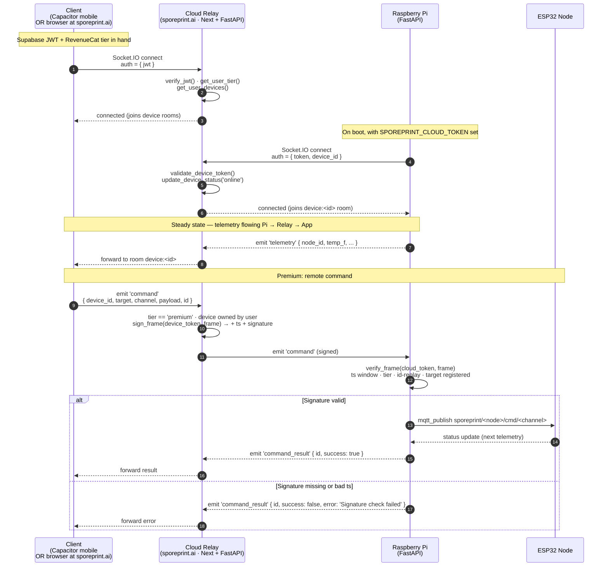

# Cloud Relay Flow

Remote access flow: client (mobile app or browser) → cloud relay at sporeprint.ai → paired Pi on the operator's LAN. v3.3.1 added HMAC-SHA256 signing over the command frames; the Pi refuses unsigned frames.

**v3.4 gating (cloud side)**: the relay refuses a Socket.IO connect whose effective tier is not `premium` — the connect raises `ConnectionRefusedError("subscription_required")`. The sequence below assumes a paying user. A free user never reaches step 1 beyond the refusal handshake. The Pi-side of the flow (steps starting at the `Pi->>Relay: Socket.IO connect`) is unaffected — Pi device-token auth doesn't know or care about mobile-user tier.

**v4 wire shape**: the browser-side Socket.IO client opens a WebSocket to `wss://sporeprint.ai/socket.io/`. The cloud-web Next.js layer's custom `server.js` listens for HTTP-upgrade events on `/socket.io/*` and proxies the WSS handshake to FastAPI on `127.0.0.1:9000`. The mobile app talks to the same URL directly (no HTTP-upgrade dance — Socket.IO falls through Next's rewrites). From the Pi's perspective, the FastAPI server it talks to is byte-compatible with the v3.x cloud — only the path taken by the *opposite* end of the relay (browser/mobile → FastAPI) changed.

## What v3.3.1 enforces

| Check | Code | Failure mode |
|---|---|---|
| HMAC-SHA256 over canonical JSON | `server/app/cloud/signing.py::verify_frame` | command dropped with `signature mismatch` |
| `ts` within ±30 s of Pi wall-clock | same | `ts outside replay window` |
| `command_id` present, not replayed | `on_command` LRU set (1024 cap) | `Replayed command id` |
| `tier == 'premium'` | `on_command` | `Remote control requires premium tier` |
| Target matches registered `hardware_nodes.node_id` or `smart_plugs.plug_id` | `_target_is_registered()` | `Unknown target '<id>'` |
| `target` / `channel` match `^[a-zA-Z0-9_-]{1,64}$` | `_is_safe_target` / `_is_safe_channel` | `Invalid target or channel` |

Pre-v3.3.1 only the tier string was checked — a compromised cloud relay could have issued any command to any registered target. v3.3.1 closes that by making the Pi require a signature it can verify.

## External services referenced in this flow

- **Supabase** — JWT + user↔device mapping
- **Firebase FCM → APNs/Android** — push (not shown; triggered by Pi events that `forward_event()` to cloud)
- **RevenueCat** — tier source (webhook updates `profiles.tier`)
- **Anthropic** — Claude vision / grow advisor (separate path, not in this sequence)
