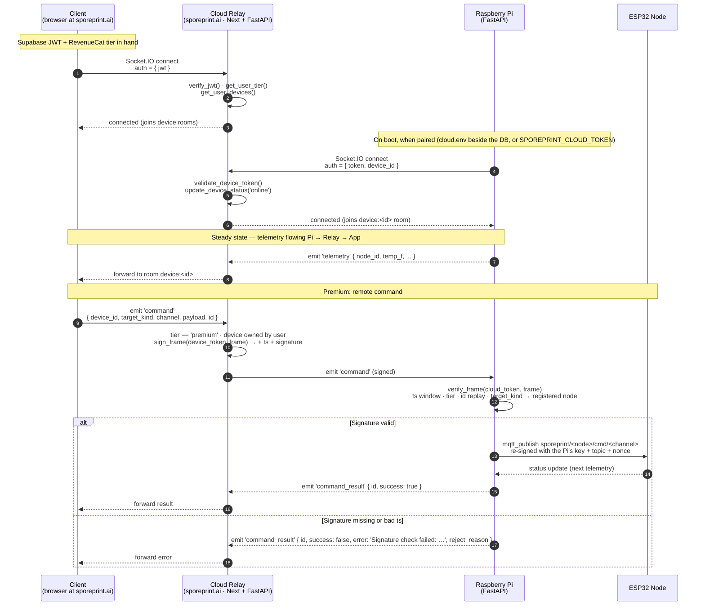

# Cloud Relay Flow

Remote access flow: client (the browser at sporeprint.ai; a React Native mobile app is being rebuilt and not released) → cloud relay at sporeprint.ai → paired Pi on the operator's LAN. v3.3.1 added HMAC-SHA256 signing over the command frames; the Pi refuses unsigned frames.

**v3.4 gating (cloud side)**: the relay refuses a Socket.IO connect whose effective tier is not `premium` — the connect raises `ConnectionRefusedError("subscription_required")`. The sequence below assumes a paying user. A free user never reaches step 1 beyond the refusal handshake. The Pi-side of the flow (steps starting at the `Pi->>Relay: Socket.IO connect`) is unaffected — Pi device-token auth doesn't know or care about mobile-user tier.

**v4 wire shape**: the browser-side Socket.IO client opens a WebSocket to `wss://sporeprint.ai/socket.io/`. The cloud-web Next.js layer's custom `server.js` listens for HTTP-upgrade events on `/socket.io/*` and proxies the WSS handshake to FastAPI on `127.0.0.1:9001` (Next itself listens on `$PORT`, default 9000). A native client would talk to the same URL. From the Pi's perspective, the FastAPI server it talks to is byte-compatible with the v3.x cloud — only the path taken by the *opposite* end of the relay (browser/mobile → FastAPI) changed.


```mermaid
sequenceDiagram
    autonumber
    participant App as Client<br/>(browser at sporeprint.ai)
    participant Relay as Cloud Relay<br/>(sporeprint.ai · Next + FastAPI)
    participant Pi as Raspberry Pi<br/>(FastAPI)
    participant ESP as ESP32 Node

    Note over App: Supabase JWT + RevenueCat tier in hand
    App->>Relay: Socket.IO connect<br/>auth = { jwt }
    Relay->>Relay: verify_jwt() · get_user_tier()<br/>get_user_devices()
    Relay-->>App: connected (joins device rooms)

    Note over Pi: On boot, when paired (cloud.env beside the DB, or SPOREPRINT_CLOUD_TOKEN)
    Pi->>Relay: Socket.IO connect<br/>auth = { token, device_id }
    Relay->>Relay: validate_device_token()<br/>update_device_status('online')
    Relay-->>Pi: connected (joins device:<id> room)

    Note over App,Pi: Steady state — telemetry flowing Pi → Relay → App
    Pi-->>Relay: emit 'telemetry' { node_id, temp_f, ... }
    Relay-->>App: forward to room device:<id>

    Note over App,ESP: Premium: remote command
    App->>Relay: emit 'command'<br/>{ device_id, target_kind, channel, payload, id }
    Relay->>Relay: tier == 'premium' · device owned by user<br/>sign_frame(device_token, frame) → + ts + signature
    Relay->>Pi: emit 'command' (signed)

    Pi->>Pi: verify_frame(cloud_token, frame)<br/>ts window · tier · id replay · target_kind → registered node
    alt Signature valid
        Pi->>ESP: mqtt_publish sporeprint/<node>/cmd/<channel><br/>re-signed with the Pi's key + topic + nonce
        ESP-->>Pi: status update (next telemetry)
        Pi-->>Relay: emit 'command_result' { id, success: true }
        Relay-->>App: forward result
    else Signature missing or bad ts
        Pi-->>Relay: emit 'command_result' { id, success: false, error: 'Signature check failed: …', reject_reason }
        Relay-->>App: forward error
    end
```

## What the Pi enforces on every cloud command

All in `server/app/cloud/service.py::handle_cloud_command`, in this order:

| Check | Code | Failure mode |
|---|---|---|
| HMAC-SHA256 over canonical JSON, keyed with the Pi's cloud token | `server/app/cloud/signing.py::verify_frame` | `Signature check failed: signature mismatch` (`reject_reason: signature_mismatch`) |
| `ts` within ±30 s of the Pi's clock | same | `Signature check failed: ts outside replay window` (`reject_reason: clock_skew`; fix the Pi's NTP) |
| `tier == 'premium'` | `handle_cloud_command` | `Remote control requires premium tier` |
| `id` present and not seen before | an in-memory FIFO of 1024 ids, written through to the `cloud_command_replay` table so a restart inside the window still rejects a replay | `Replayed command id` |
| `target_kind` is `climate`, `relay`, `lighting`, `camera`, `system` or `automation`; `channel` matches `^[a-zA-Z0-9_-]{1,64}$` | `_VALID_TARGET_KINDS`, `_is_safe_channel` | `Invalid target_kind or channel` |
| A hardware `target_kind` resolves to the most recently seen registered node of that type (or role), and that node id passes the same pattern | `_resolve_node_id_by_type()`, `_is_safe_target()`, `_target_is_registered()` | `No registered <kind> node` / `Unknown target '<id>'` |

`system` (automation pause / resume, session start / end, rule suspend,
reboot, Pi OTA) and `automation` (manual overrides) are handled inside the Pi
and never reach MQTT. Before v3.3.1 only the tier string was checked, so a
compromised cloud relay could have issued any command to any registered
target; the Pi now requires a signature it can verify.

## The Pi → node leg

The cloud never signs node frames itself. After verifying a cloud command,
the Pi publishes it to `sporeprint/<node>/cmd/<channel>` **re-signed with its
own `SPOREPRINT_MQTT_HMAC_KEY`**, and binds two extra signed members: `topic`
(the full destination topic, so the frame can't be redirected to another
channel or node) and a random `nonce` (so identical commands in the same
second aren't mistaken for a replay). Nodes holding the key reject unsigned,
forged, replayed or redirected frames; see `docs/firmware-security.md`.

- A cloud-paired Pi with `SPOREPRINT_MQTT_REQUIRE_SIGNING=auto` (the default)
  refuses to publish unsigned node commands, so it needs a key:
  `install.sh` generates one, `./scripts/provision-node.sh` prints it.
- A cloud OFF to a hardware channel (`state: off`, any case) is published
  without any `pwm`/`level` (older firmware treated `{state:off, pwm:N}` as ON)
  and clears that actuator's `safety_max_on_seconds` ceiling.
- `integrations_request` frames: signed frames are replay-deduped by id (409)
  and a signature that can't be verified gets 401. After the Pi verifies its
  first signed one, unsigned frames are rejected (401); the latch resets on
  `/api/cloud/configure`. `SPOREPRINT_CLOUD_REQUIRE_SIGNED_INTEGRATIONS=true`
  rejects unsigned frames from the start.

## v4 cloud-side rechecks (before forwarding any command)

The cloud relay does its own enforcement before signing + forwarding. As of
v4, two additional rechecks happen on every inbound `command` from a client:

| Check | Frequency | Failure mode |
|---|---|---|
| Tier recheck (effective tier still `premium`) | every 30 s per session, cached | command rejected with `subscription_required` |
| Ownership recheck (`device_id ∈ user's devices`) | every 60 s per session, cached | command rejected with `Device not owned by this user` |

The recheck guarantees that a user whose subscription expires mid-session
loses control within 30 seconds (a device removed from the account, within
60 seconds) — they don't keep operating the chamber until they happen to
disconnect. The caches keep the Supabase load bounded; a
hard recheck at every command would 4-10× the auth round-trips during a
busy session.

## OTA progress events (Pi → cloud, v4)

A Pi self-update reports each step upstream so cloud-web can render a real progress bar instead of a "wait 30 s and pray"
spinner.

```
Pi: server/app/cloud/ota.py
  └─ _emit_step(step, version, channel, …)
       steps: download_started {url} → download_complete {size_bytes}
              → verify_complete {verified_by: manifest | legacy_signature}
              → extract_complete {files_extracted} → promote_complete
              → restart_initiated   (or failed {failed_at, error} at any step)
       └─ forward_event("ota_step", { step, version, channel, … })
            └─ cloud relay: @sio.on("ota_step")
                 ├─ validate step against the same seven names (refuses anything else)
                 ├─ persist to ota_progress_events (Supabase), 10 rows per device
                 └─ emit "ota_step" { device_id, step, payload } to the device room
```

A progress emit never fails the update: a Pi that cannot reach the cloud
still completes its OTA.

`_promote_and_restart` was also split into `_promote` + `_restart_unit` so
the failure mode is recoverable — if `_promote` succeeds but the systemd
restart fails, the next `_restart_unit` attempt resumes from the right
place rather than re-promoting.

OTA releases are Ed25519-signed (`generate-ota-keypair.py` +
`sign-ota-bundle.py` in `sporeprint/scripts/`; the private repo's
`server-release.yml` signs and publishes them). Each release has a signed
manifest, `{version}.manifest.json` + `.manifest.json.sig`: canonical JSON
`{schema, artifact, version, channel, sha256, size, published_at}`, defined in
`server/app/cloud/ota_manifest.py` and pinned by
`server/tests/fixtures/ota_manifest_vectors.json`. The Pi checks it against
its locally pinned key before downloading the bundle. A key the cloud puts in
the command (`ota_pubkey`) is ignored.

```
Pi: ota.run_ota_update(version, channel)
  ├─ validate: format · channel == SPOREPRINT_OTA_CHANNEL · not older than installed
  ├─ manifest: fetch .manifest.json + .sig → Ed25519 over the exact bytes →
  │            canonical form → artifact/version/channel match → anti-rollback
  ├─ download: bundle, capped at the signed size
  ├─ verify:   sha256 + size == manifest   (verify_complete: verified_by)
  └─ stage → promote (records the anti-rollback floor) → restart
```

The release also keeps publishing the legacy `{version}.tar.gz.sig` (a
signature over the bundle bytes only) so Pis from before signed manifests
can still update. A current Pi uses it only when a release has no manifest
(HTTP 403/404/410) **and** `SPOREPRINT_OTA_ALLOW_LEGACY_SIGNATURE=true`. A
manifest that exists but has no signature, a bad one or the wrong contents
fails the update and never falls back.

Limits of Pi self-update:
- The Docker install refuses a `system/ota` command (`success=false`, "Pi
  self-update is not supported in the Docker deployment"); update a Docker Pi
  on the Pi with `git pull && ./install.sh`. Self-update needs the bare-metal
  `<SPOREPRINT_INSTALL_ROOT>/current` symlink layout.
- A command for a channel other than the Pi's `SPOREPRINT_OTA_CHANNEL`
  (default `stable`), or for a version lower than the installed one or the
  floor recorded by the last OTA, is refused before it is acknowledged. Only
  `SPOREPRINT_OTA_ALLOW_DOWNGRADE=true` on the Pi allows a downgrade; the
  command cannot. Pre-release suffixes are not ordered (X.Y.Z only). Only one
  OTA runs at a time.
- No revocation: any genuine release on the Pi's channel that is not older
  than the install can still be requested, including a pulled one. Remove a
  bad release from the release host.

## External services referenced in this flow

- **Supabase** — JWT + user↔device mapping
- **Firebase FCM** — native push for the mobile app once it ships (not shown; nothing receives it today, and browser push is built but not live yet)
- **RevenueCat** — tier source (webhook updates `profiles.tier`)
- **Anthropic** — Claude vision / grow advisor (separate path, not in this sequence)
