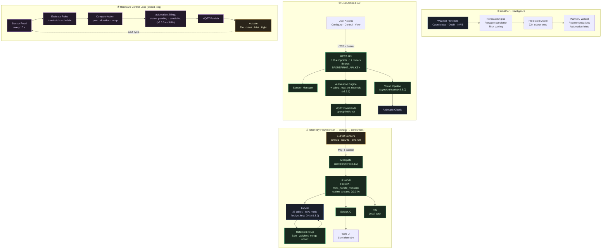

# Data Flow

How data moves through the SporePrint system across its four main flows: sensor telemetry, weather intelligence, user actions, and the closed-loop hardware control path.

> **Cloud-side context (v4)**: from the Pi's perspective, nothing about these flows changed. The cloud upgraded its public surface from a Vite SPA at `/app/*` to a Next.js 15 App Router app at `/`, both running on the same Railway service that has always handled the Pi's cloud connector. Telemetry / commands / heartbeats still hit the same `https://sporeprint.ai` Socket.IO endpoint.

## Notable v3.3.x changes visible in the data flow

- **Telemetry ts clamp** — `mqtt._handle_message` treats any `ts < 2020-01-01` as firmware uptime-seconds and replaces it with server time. Prevents 1970-epoch rows from offline-buffer drain.
- **Retention rollup upsert** — `INSERT ... ON CONFLICT DO UPDATE` with weighted-mean merging replaces the old `INSERT OR IGNORE + DELETE` (which could lose raw rows on partial retries).
- **Rule-fire audit ordering** — firings are now written `status='pending'` → publish → `status='sent'|'failed'`. The audit log no longer lies during MQTT reconnect windows.
- **`safety_max_on_seconds` watchdog** — when an ON publish succeeds for a rule with a non-zero max, a cancellable auto-off task arms. Prevents stuck-on heaters.
- **`AsyncAnthropic` on Pi** — vision, transcript, builder, contamination, experiments all await Claude calls. Prior sync SDK froze the event loop 3-15 s per call.
- **Auth'd MQTT broker** — `allow_anonymous false`, credentials in NVS on every node. Previously the broker on 1883 would accept any publisher.

## Notable v4.0.0 changes visible in the data flow

- **OTA progress emit** — `ota.py::_emit_step()` now calls `forward_event("ota_step", payload)` per phase (`downloading` / `verifying` / `promoting` / `restarting` / `healthy` / `failed`), so the cloud + mobile + browser can render a real OTA progress bar. `_promote_and_restart` was split into `_promote` + `_restart_unit` for recoverability.
- **Firmware coredump partition** — `firmware/partitions.csv` adds a 64 KB coredump slot at `0x3F0000`. `coredump.{h,cpp}` (`isPresent / readChunked / erase / uploadIfPresent`) is called from each node's `setup()` so a crashed boot ships its coredump once Wi-Fi + MQTT are up, then erases it.
- **Firmware log forwarding ring buffer** — `log_forward.{h,cpp}` exposes `SP_LOG()` backed by a 32-entry × 200-byte ring drained over MQTT. Lets us see what a node logged in the seconds before a crash without an attached serial cable.
- **OTA bundle signatures** — Ed25519 helpers in the submodule's `scripts/`: `generate-ota-keypair.py` mints the keypair, `sign-ota-bundle.py` signs each shipped bundle. Cloud verifies before promotion; Pi verifies during `_promote`.
- **Lockstep version bump** — Pi server / firmware / Pi UI / cloud all carry `4.0.0` simultaneously. The protocol surface against pre-v4 clouds is unchanged; the bump is bookkeeping for the parent monorepo's release cadence.
