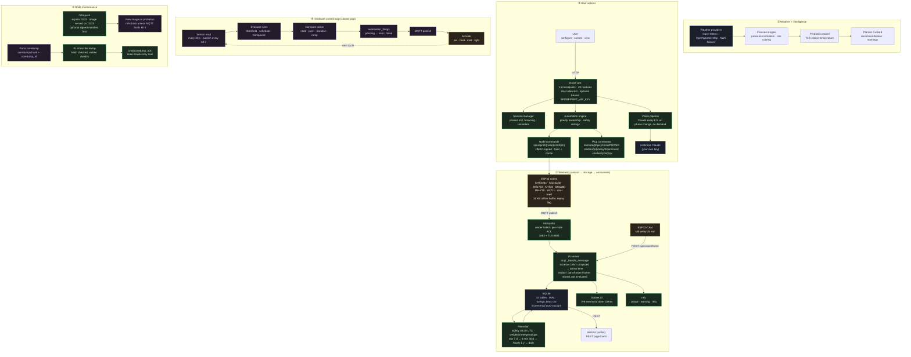

# Data Flow

How data moves through the SporePrint system: sensor telemetry, weather
intelligence, user actions, the closed-loop hardware control path, and node
maintenance (OTA and crash dumps). Everything here runs on the Pi and the
LAN. A cloud-paired Pi also forwards telemetry and events to
`https://sporeprint.ai` over Socket.IO and takes signed commands back
([cloud-relay-flow.md](cloud-relay-flow.md)); none of these flows depends on
it.

```mermaid
flowchart TB
    subgraph TelemetryFlow["① Telemetry (sensor → storage → consumers)"]
        ESP["ESP32 nodes<br/>SHT3x/4x · SCD4x/30 · BH1750 · AHT20 · BMx280<br/>MH-Z19 · HX711 · door reed<br/>16 KB offline buffer, replay flag"]
        Cam["ESP32-CAM<br/>still every 15 min"]
        Mosq["Mosquitto<br/>credentialed · per-node ACL<br/>1883 + TLS 8883"]
        PiSrv["Pi server · mqtt._handle_message<br/>ts below 1e9 = unsynced → arrival time<br/>replay / out-of-order frames stored, not evaluated"]
        SQLite["SQLite<br/>33 tables · WAL · foreign_keys ON<br/>incremental auto-vacuum"]
        Retention["Retention<br/>nightly 03:00 UTC · weighted-merge rollups<br/>raw 7 d → 5 min 30 d → hourly 1 y → daily"]
        SIO["Socket.IO<br/>live events for other clients"]
        WebUI["Web UI (ui/dist)<br/>REST page loads"]
        Ntfy["ntfy<br/>critical · warning · info"]

        ESP -->|MQTT publish| Mosq
        Mosq --> PiSrv
        Cam -->|POST /api/vision/frame| PiSrv
        PiSrv --> SQLite
        PiSrv --> SIO
        PiSrv --> Ntfy
        SQLite -->|REST| WebUI
        SQLite --> Retention
        Retention --> SQLite
    end

    subgraph WeatherFlow["② Weather + intelligence"]
        WeatherAPI["Weather providers<br/>Open-Meteo · OpenWeatherMap · NWS<br/>failover"]
        Forecast["Forecast engine<br/>pressure correlation · risk scoring"]
        Prediction["Prediction model<br/>72 h indoor temperature"]
        Planner["Planner / wizard<br/>recommendations · warnings"]

        WeatherAPI --> Forecast
        Forecast --> Prediction
        Prediction --> Planner
    end

    subgraph UserFlow["③ User actions"]
        User["User<br/>configure · control · view"]
        REST["REST API<br/>150 endpoints · 20 modules<br/>Host allow-list · optional bearer SPOREPRINT_API_KEY"]
        Sessions["Session manager<br/>phases incl. browning · reminders"]
        Auto["Automation engine<br/>priority ownership · safety ceilings"]
        Vision["Vision pipeline<br/>Claude every 6 h, on phase change, on demand"]
        MQTTCmd["Node commands<br/>sporeprint/{node}/cmd/{ch}<br/>HMAC-signed · topic + nonce"]
        PlugCmd["Plug commands<br/>tasmota/{topic}/cmnd/POWER<br/>shellies/{id}/relay/0/command · shellies/{role}/rpc"]
        Claude["Anthropic Claude<br/>(your own key)"]

        User -->|HTTP| REST
        REST --> Sessions
        REST --> Auto
        REST --> Vision
        Auto --> MQTTCmd
        Auto --> PlugCmd
        MQTTCmd --> ESP
        Vision --> Claude
    end

    subgraph ControlLoop["④ Hardware control loop (closed loop)"]
        Sense["Sensor read<br/>every 30 s · publish every 60 s"]
        Eval["Evaluate rules<br/>threshold · schedule · compound"]
        Compute["Compute action<br/>state · pwm · duration · ramp"]
        Log["automation_firings<br/>pending → sent / failed"]
        Publish["MQTT publish"]
        Actuate["Actuate<br/>fan · heat · mist · light"]

        Sense --> Eval
        Eval --> Compute
        Compute --> Log
        Log --> Publish
        Publish --> Actuate
        Actuate -.->|next cycle| Sense
    end

    subgraph Maintenance["⑤ Node maintenance"]
        OtaPush["OTA push<br/>espota :3232 · image served on :3233<br/>optional signed manifest first"]
        Probation["New image on probation<br/>rolls back unless MQTT holds 60 s"]
        Dump["Panic coredump<br/>coredump/chunk + coredump_id"]
        Store["Pi stores the dump<br/>hash checked, written durably"]
        Ack["cmd/coredump_ack<br/>node erases only now"]

        OtaPush --> Probation
        Dump --> Store
        Store --> Ack
    end

    classDef hw fill:#2a241a,stroke:#d9a441,color:#ffd;
    classDef svc fill:#1a2a1f,stroke:#3dd68c,color:#dfd;
    classDef store fill:#1a1f2a,stroke:#6b93d6,color:#ddf;
    classDef loop fill:#231a2a,stroke:#a06bd6,color:#e8d8ff;
    class ESP,Cam,Actuate hw;
    class Mosq,PiSrv,REST,Sessions,Auto,Vision,MQTTCmd,PlugCmd,SIO,Ntfy,Retention,OtaPush,Store,Ack svc;
    class SQLite,Claude,WeatherAPI store;
    class Sense,Eval,Compute,Publish,Log,Probation,Dump loop;
```

## ① Telemetry

- **Timestamps.** A node stamps each frame with epoch seconds once NTP has
  synced. The Pi treats `ts < 1e9` as unsynced firmware uptime and stamps the
  arrival time instead.
- **Liveness.** Frames flagged `"replay": true` (drained from the node's
  16 KB offline buffer) and out-of-order frames (up to 120 s older than the
  node's newest live frame; a bigger step back is a clock correction and
  re-baselines) are stored at their own time, but are not pushed to the live
  socket and never evaluated by the rules. The Pi's own clock never decides
  whether a frame is live. Pi-vs-node skew is logged past 120 s and reported
  per node under `reliability` in `GET /api/health/detail/system`.
- **Session tagging.** Each reading is tagged with the grow its node belongs
  to: a node listed in a chamber belongs to that chamber's grow; a node in no
  chamber belongs to the newest grow bound to no chamber.
- **Node health.** Nodes send a heartbeat every min(publish interval, 5 min);
  any telemetry frame from a registered node also refreshes `last_seen`.
  `health` carries per-sensor driver status, and `logs` forwards the node's
  last log lines (a 32 × 200-byte ring), so what a node logged before a crash
  is visible without a serial cable.
- **Payload.** The telemetry keys are the firmware's wire contract
  (`firmware/lib/sp_core/wire_contract.h`); every key is optional, and a node
  publishes only what it has. A BME280 / BMP280 adds `pressure_hpa`.
- **Camera frames** arrive over HTTP, not MQTT (`POST /api/vision/frame`,
  from a camera registered in `hardware_nodes`). Frames are kept 30 days,
  then thinned to one per camera per day; flagged, labelled and referenced
  frames are always kept.
- **Retention.** The nightly job (03:00 UTC) rolls raw readings older than
  7 days into 5-minute averages, those older than 30 days into hourly ones,
  and hourly ones older than a year into daily ones, with an
  `INSERT … ON CONFLICT DO UPDATE` weighted-mean merge, so a retried run never
  loses rows. It also prunes `automation_firings` older than 90 days that
  belong to no session. New databases use incremental auto-vacuum.

## ② Weather + intelligence

The weather poller (every `SPOREPRINT_WEATHER_POLL_MINUTES`, default 10)
fails over across Open-Meteo, OpenWeatherMap and NWS. The prediction model
learns how outdoor weather moves the closet and warns up to 72 hours ahead
when a species target is at risk; the planner scores species against the
local climate history.

## ③ User actions

- **The API** answers only for LAN host names (the DNS-rebinding guard) and,
  with `SPOREPRINT_API_KEY` set, only with the bearer ([auth.md](auth.md)).
- **Sessions.** Phase changes are validated against the species profile.
  Shiitake has a `browning` phase between substrate colonization and
  primordia induction; its exit reminder (the cold-water soak) reaches the
  session log, the daily 09:00 phase reminder and `GET /next-phase`, and
  vision reports `browning_percent`.
- **Vision.** Claude auto-analysis runs every 6 h per session
  (`SPOREPRINT_VISION_AUTO_INTERVAL_MIN`), on the first frame after each
  phase change, and on demand. A confident contamination read (≥ 0.6) pages
  CRITICAL; 0.3–0.6 sends one WARNING. The local CNN layer is still a stub.
- **Node commands.** Every `cmd/*` frame is HMAC-signed with
  `SPOREPRINT_MQTT_HMAC_KEY`, with the destination `topic` and a random
  `nonce` bound in; an OFF never carries `pwm` / `level`. A cloud-paired Pi
  with no key refuses to publish unsigned commands (503)
  ([firmware-security.md](firmware-security.md)).
- **Smart plugs** talk MQTT straight to the broker: Tasmota (Full Topic
  `tasmota/%topic%/%prefix%/`), Shelly Gen1 (`shellies/<id>/relay/0`) and
  Shelly Gen2+ (JSON-RPC under the MQTT prefix `shellies/<role>`: `rpc`,
  `events/rpc`, `status/switch:<n>`, `online`). Plug online / offline is
  tracked and pushed as `plug_online`
  ([integrations/smart-plugs.md](integrations/smart-plugs.md)).

## ④ Hardware control loop

- **Rule evaluation** runs on every telemetry ingest. The highest-priority
  rule whose condition holds owns an actuator. Life-safety rules (priority
  ≥ 20, absolute thresholds) run even with no active session.
- **Audit order.** A firing is written `status='pending'`, then published,
  then marked `sent` or `failed`, so the log never claims a command a broker
  outage swallowed.
- **Safety ceilings.** `safety_max_on_seconds` counts from the first ON; a
  tripped held-ON ceiling switches the device off and locks automation out of
  it for 15 min. Manual overrides carry a 24 h ceiling and resume automation
  when they expire.
- **On the node,** every switch channel has its own max-on backstop (30 min,
  60 s on `aux`), 10 minutes without MQTT switches every channel off, and an
  explicit `"state":"off"` always wins.

## ⑤ Node maintenance

- **OTA push.** The Pi pushes a `.bin` over the espota protocol (UDP/TCP
  3232) and serves the image to that node only on TCP 3233. A push can first
  send a signed release manifest (`cmd/ota_manifest`): the Pi checks it
  against its pinned key and the uploaded image, and a node image built with
  the key flashes only that exact image. A new image is on probation and
  rolls back unless it holds MQTT for 60 s. Lifecycle events land on
  `sporeprint/<node>/ota`.
- **Coredumps are store-then-ack.** A panic dump stays in the node's
  `coredump` partition (64 KB in the WROOM-32's 4 MB table, 128 KB on the S3
  boards). The node uploads it on `coredump/chunk` with
  `coredump_id` (the dump's SHA-256); the Pi checks the reassembled bytes
  against the id, writes the file durably, and only then publishes
  `cmd/coredump_ack`. The node erases its copy only on that ack; without one
  it retries with backoff and keeps the dump.
- **Pi self-update** (bare-metal installs) verifies a signed release manifest
  (version, channel, sha256, size) before it downloads the bundle, and
  reports each step to the cloud as `ota_step`. The Docker install updates
  with `git pull && ./install.sh` instead.
