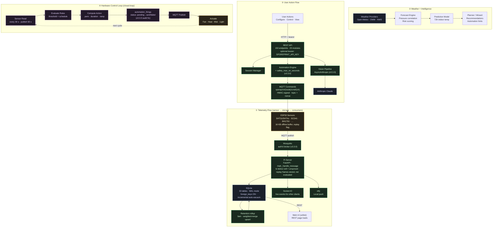

# Data Flow

How data moves through the SporePrint system across its four main flows: sensor telemetry, weather intelligence, user actions, and the closed-loop hardware control path.

> **Cloud-side context (v4)**: from the Pi's perspective, nothing about these flows changed. The cloud upgraded its public surface from a Vite SPA at `/app/*` to a Next.js 15 App Router app at `/`, both running on the same Railway service that has always handled the Pi's cloud connector. Telemetry / commands / heartbeats still hit the same `https://sporeprint.ai` Socket.IO endpoint.

```mermaid
flowchart TB
    subgraph TelemetryFlow["① Telemetry Flow (sensor → storage → consumers)"]
        ESP["ESP32 Sensors<br/>SHT31/SHT4x · SCD41 · BH1750 · …<br/>16 KB offline buffer, replay flag"]
        Mosq["Mosquitto<br/>auth'd broker (v3.3.0)"]
        PiSrv["Pi Server<br/>FastAPI · mqtt._handle_message<br/>ts below 1e9 = unsynced · replay frames stored, not evaluated"]
        SQLite["SQLite<br/>33 tables · WAL mode<br/>foreign_keys ON · incremental auto-vacuum"]
        Retention["Retention rollup<br/>3am · weighted-merge upsert"]
        SIO["Socket.IO<br/>live events for other clients"]
        WebUI["Web UI (ui/dist)<br/>REST page loads"]
        Ntfy["ntfy<br/>Local push"]

        ESP -->|MQTT publish| Mosq
        Mosq --> PiSrv
        PiSrv --> SQLite
        PiSrv --> SIO
        PiSrv --> Ntfy
        SQLite -->|REST| WebUI
        SQLite --> Retention
        Retention --> SQLite
    end

    subgraph WeatherFlow["② Weather + Intelligence"]
        WeatherAPI["Weather Providers<br/>Open-Meteo · OWM · NWS"]
        Forecast["Forecast Engine<br/>Pressure correlation<br/>Risk scoring"]
        Prediction["Prediction Model<br/>72h indoor temp"]
        Planner["Planner / Wizard<br/>Recommendations<br/>Automation hints"]

        WeatherAPI --> Forecast
        Forecast --> Prediction
        Prediction --> Planner
    end

    subgraph UserFlow["③ User Action Flow"]
        User["User Actions<br/>Configure · Control · View"]
        REST["REST API<br/>150 endpoints · 20 modules<br/>optional bearer: SPOREPRINT_API_KEY"]
        Sessions["Session Manager"]
        Auto["Automation Engine<br/>+ safety_max_on_seconds (v3.3.0)"]
        Vision["Vision Pipeline<br/>AsyncAnthropic (v3.3.0)"]
        MQTTCmd["MQTT Commands<br/>sporeprint/{node}/cmd/{ch}<br/>HMAC-signed · topic + nonce"]
        Claude["Anthropic Claude"]

        User -->|HTTP + bearer| REST
        REST --> Sessions
        REST --> Auto
        REST --> Vision
        Auto --> MQTTCmd
        MQTTCmd --> ESP
        Vision --> Claude
    end

    subgraph ControlLoop["④ Hardware Control Loop (closed-loop)"]
        Sense["Sensor Read<br/>every 30 s · publish 60 s"]
        Eval["Evaluate Rules<br/>threshold + schedule"]
        Compute["Compute Action<br/>pwm · duration · ramp"]
        Publish["MQTT Publish"]
        Actuate["Actuate<br/>Fan · Heat · Mist · Light"]
        Log["automation_firings<br/>status: pending→sent/failed<br/>(v3.3.0 audit fix)"]

        Sense --> Eval
        Eval --> Compute
        Compute --> Log
        Log --> Publish
        Publish --> Actuate
        Actuate -.->|next cycle| Sense
    end

    classDef hw fill:#2a241a,stroke:#d9a441,color:#ffd;
    classDef svc fill:#1a2a1f,stroke:#3dd68c,color:#dfd;
    classDef store fill:#1a1f2a,stroke:#6b93d6,color:#ddf;
    classDef loop fill:#231a2a,stroke:#a06bd6,color:#e8d8ff;
    class ESP,Actuate hw;
    class Mosq,PiSrv,REST,Sessions,Auto,Vision,MQTTCmd,SIO,Ntfy,Retention svc;
    class SQLite,Claude,WeatherAPI store;
    class Sense,Eval,Compute,Publish,Log loop;
```

## Notable v3.3.x changes visible in the data flow

- **Telemetry ts clamp** — `mqtt._handle_message` treats any `ts < 2020-01-01` as firmware uptime-seconds and replaces it with server time. Prevents 1970-epoch rows from offline-buffer drain.
- **Retention rollup upsert** — `INSERT ... ON CONFLICT DO UPDATE` with weighted-mean merging replaces the old `INSERT OR IGNORE + DELETE` (which could lose raw rows on partial retries).
- **Rule-fire audit ordering** — firings are now written `status='pending'` → publish → `status='sent'|'failed'`. The audit log no longer lies during MQTT reconnect windows.
- **`safety_max_on_seconds` watchdog** — when an ON publish succeeds for a rule with a non-zero max, a cancellable auto-off task arms. Prevents stuck-on heaters.
- **`AsyncAnthropic` on Pi** — vision, transcript, builder, contamination, experiments all await Claude calls. Prior sync SDK froze the event loop 3-15 s per call.
- **Auth'd MQTT broker** — `allow_anonymous false`, credentials in NVS on every node. Previously the broker on 1883 would accept any publisher.

## Notable v4.0.0 changes visible in the data flow

- **OTA progress emit** — `ota.py::_emit_step()` now calls `forward_event("ota_step", payload)` per phase (`downloading` / `verifying` / `promoting` / `restarting` / `healthy` / `failed`), so the cloud + mobile + browser can render a real OTA progress bar. `_promote_and_restart` was split into `_promote` + `_restart_unit` for recoverability.
- **Firmware coredump partition** — `firmware/partitions.csv` adds a 64 KB coredump slot at `0x3F0000`. `coredump.{h,cpp}` (`isPresent / readChunked / erase / uploadIfPresent`) is called from each node's `setup()` so a crashed boot ships its coredump once Wi-Fi + MQTT are up, then erases it. (Now `sp_device/coredump_uploader.{h,cpp}`: it uploads from `loop()` and erases the dump only when the Pi acknowledges it on `cmd/coredump_ack`, which `server/app/hardware/coredumps.py` sends once the dump is durably stored.)
- **Firmware log forwarding ring buffer** — `log_forward.{h,cpp}` exposes `SP_LOG()` backed by a 32-entry × 200-byte ring drained over MQTT. Lets us see what a node logged in the seconds before a crash without an attached serial cable.
- **OTA bundle signatures** — Ed25519 helpers in the submodule's `scripts/`: `generate-ota-keypair.py` mints the keypair, `sign-ota-bundle.py` signs each shipped bundle. Cloud verifies before promotion; Pi verifies during `_promote`.
- **Lockstep version bump** — Pi server / firmware / Pi UI / cloud all carry `4.0.0` simultaneously. The protocol surface against pre-v4 clouds is unchanged; the bump is bookkeeping for the parent monorepo's release cadence.

## Changes from the 2026-09 audit (unreleased)

- **Telemetry timestamps** — the Pi now treats `ts < 1e9` as unsynced firmware uptime and stamps arrival time (the old cut-off was 2020-01-01). Frames flagged `"replay": true`, and out-of-order frames (up to 120 s older than the node's newest live frame; a bigger step back is a clock correction and re-baselines), are stored at their own time but are not pushed to the live socket and never evaluated by the rules. The Pi's own clock never decides whether a frame is live (a Pi clock running fast used to stop automation for every synced node); Pi-vs-node skew is logged past 120 s and reported per node under `reliability` in `GET /api/health/detail/system`.
- **Session tagging** — each reading is tagged with the grow its node belongs to: a node listed in a chamber belongs to that chamber's grow; a node in no chamber belongs to the newest grow bound to no chamber.
- **Node liveness** — nodes send their heartbeat every min(publish interval, 5 min), and any telemetry frame from a registered node also refreshes `last_seen`.
- **Rule evaluation** — the highest-priority rule whose condition holds owns an actuator; `safety_max_on_seconds` counts from the first ON and a trip locks automation out of that actuator for 15 min; life-safety rules (priority ≥ 20, absolute thresholds) run even with no active session.
- **Commands** — every `cmd/*` frame is HMAC-signed with the destination `topic` and a random `nonce` bound in; an OFF never carries `pwm`/`level`.
- **Vision** — Claude auto-analysis runs every 6 h per session (`SPOREPRINT_VISION_AUTO_INTERVAL_MIN`) plus the first frame after each phase change; frames older than 30 days are thinned to one per camera per day.
- **Retention** — the nightly job also prunes `automation_firings` older than 90 days that belong to no session, and new databases use incremental auto-vacuum.

## Changes from the 2026-10 follow-ups (unreleased)

- **Coredumps are store-then-ack** — a node uploads a panic dump on `sporeprint/<node>/coredump/chunk` with `coredump_id` (the dump's SHA-256); the Pi checks the reassembled bytes against the id, writes the file durably, and only then publishes `cmd/coredump_ack`. The node erases its flash copy only on that ack.
- **Signed OTA manifests** — the Pi self-update verifies a signed release manifest (version, channel, sha256, size) before it downloads the bundle; a node OTA push can send the same kind of manifest first (`cmd/ota_manifest`), which a node image built with the key enforces.
- **Shelly Gen2+ plugs** — JSON-RPC under `shellies/<role>/…` (`rpc`, `events/rpc`, `status/switch:<n>`, `online`) next to Gen1 and Tasmota; plug online/offline is tracked and pushed as `plug_online`.
- **Shiitake browning** — a `browning` phase between substrate colonization and primordia induction; its exit reminder (the cold-water soak) reaches the session log, the daily phase reminder and `GET /next-phase`, and vision reports `browning_percent`.
- **BME280 / BMP280** — the telemetry contract gains the optional `pressure_hpa` key.
