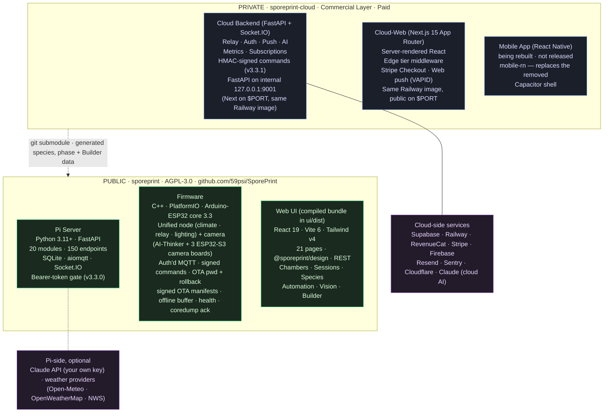

# Dual-Repository Architecture

Open-source Pi-side core + private commercial cloud layer. The commercial repo consumes the open-source one as a git submodule and adds the cloud relay, the browser cloud-web shell and the subscription / admin layer. A React Native mobile app is being rebuilt there and is not released.

**v3.4 business-model clarification**: this public repo (the Pi side) is free, open-source AGPL-3.0. The private repo (cloud + cloud-web, and the mobile app once it ships) is entirely a paid commercial product — `require_premium` (402 `subscription_required`) gates every cloud data endpoint, the cloud relay refuses free Socket.IO clients, and the cloud-web edge middleware redirects free users to `/pricing?upsell=1`. That doesn't change anything about the Pi's behavior or the git-submodule coupling documented below. It does mean that if you're running the Pi standalone without a commercial subscription, the "commercial layer" half of this diagram is invisible to you — and that's a supported configuration.

**v4 layout shift on the private side**: the private browser surfaces and the Pi dashboard source now live in a pnpm monorepo at `frontend/packages/{cloud-web,pi-ui,design}/`. The Capacitor mobile package was removed (2026-07); a React Native mobile client (`mobile-rn`) is being built and is not yet a workspace package. The cloud-web package is a Next.js 15 App Router app that ships **inside the same Railway service and Docker image** as the FastAPI cloud (`cloud/`). There is no `api.sporeprint.ai` subdomain and no separate Railway service — Next.js binds to `$PORT` and proxies `/api/*`, `/socket.io/*`, `/health/*`, `/docs/*`, `/firmware/*`, `/subscriptions/*`, `/webhooks/*` to FastAPI on internal `127.0.0.1:9001`. From this Pi-side repo's perspective, none of that matters: the cloud connector still talks to `https://sporeprint.ai`.

## Tier model at the boundary (v3.4+ / v4)

| Capability | Free (Pi self-host, OSS) | Subscription ($4.99/mo · $39.99/yr) |
|---|---|---|
| Pi software (this repo) | ✓ AGPL-3.0, run it yourself | ✓ |
| Pi's own web UI on LAN | ✓ Full control, no paygate | ✓ |
| Remote access | The Pi's own web UI over your own Tailscale | Cloud relay through the web app (HMAC-signed commands) |
| Mobile app | Not available: the React Native app is being rebuilt | Not available yet |
| Cloud-web (`sporeprint.ai`) | ✗ Edge middleware redirects to `/pricing?upsell=1` | ✓ Full |
| Pair Pi to commercial cloud | ✗ (`/devices/pair` → 402) | ✓ |
| Push notifications | ntfy on the Pi (LAN) | ntfy on the Pi; browser push is built but not live yet |
| AI vision + advisor on the Pi | ✓ BYOK (your own Anthropic key, stored on the Pi) | ✓ BYOK on-Pi OR cloud-managed |
| Cloud AI (`/ai/*`) | ✗ (`require_premium` returns 402) | ✓ rate-limited or BYOK for unlimited |
| Cultures / Experiments / Planner (cloud) | ✗ | ✓ (added in v4) |
| Analytics / export / historical data durability | ✗ | ✓ |

Key boundary: the Pi itself has **no paygate**. All paywalling lives in the commercial cloud (`require_premium` for REST, `subscription_required` for relay Socket.IO) and the cloud-web edge middleware (`tier === 'premium'` check on every protected route). A Pi-only user never encounters either.

## Repo coupling contract

- The private repo **pins** a specific public-repo SHA (the submodule gitlink in its tree; `.gitmodules` holds only the path and URL). Bumping it is an explicit `git add sporeprint/` + commit, never a floating pointer.
- **Lockstep version bumps**: the parent's `scripts/bump.sh` is the single authority — it edits `cloud/pyproject.toml` (the canonical version), `sporeprint/server/pyproject.toml`, `sporeprint/server/app/main.py`, `sporeprint/firmware/VERSION.txt`, the Pi README's `**Version:**` line and the monorepo's own packages (the Pi UI's version lives in `frontend/packages/pi-ui`; `ui/dist` is rebuilt out of band) so every shipped artifact reports the same version. The Pi-side does not have its own `bump.sh`.
- **Pi UI source vs bundle**: the source lives in the parent at `frontend/packages/pi-ui/`; the compiled output lands in the submodule at `sporeprint/ui/dist/`. The submodule's `.gitignore` has an explicit `!ui/dist/` exception so the prebuilt bundle is committed. The Pi pulls the submodule and serves the bundle locally — no Node toolchain required on the Pi.
- The species library auto-syncs: `frontend/packages/design/src/data/speciesProfiles.ts` is generated from `sporeprint/server/app/species/profiles.py` by the parent's `scripts/port_species.py`, so the Pi remains the source of truth for the 74-entry library; `scripts/port_enums.py` generates the dashboard's phase list from the Pi's `GrowPhase`, and `scripts/port_builder.py` the Builder page's built-in BOM, model and firmware data.
- The private repo **never modifies** submodule files in-place from cloud-side branches. Submodule edits land via a branch + PR inside `sporeprint/`, then the parent bumps the pointer via `scripts/bump.sh` and `scripts/sync-after-merge.sh` (the post-merge script reconciles the submodule SHA after GitHub's squash-merge rewrites).
- The public-repo tests (`cd sporeprint/server && pytest`) must stay green after any private-repo-driven public change. No CI runs on push or PR, so the local checks (`AGENTS.md` → Commands) and the release checklist are the gate.

## What lives where (v4)

| Concern | Public (sporeprint) | Private (sporeprint-cloud) |
|---|---|---|
| Telemetry ingest | ✅ mqtt.py + aiosqlite | — |
| Automation engine | ✅ (safety watchdog, overrides, rules) | — |
| Pi local UI source code | — | ✅ `frontend/packages/pi-ui/` (parent monorepo) |
| Pi local UI compiled bundle | ✅ `sporeprint/ui/dist/` (git-tracked via `!ui/dist/` exception) | builds into the submodule |
| Vision stub + Claude via Pi | ✅ | — |
| Mobile client | — | ✅ React Native rebuild in progress (`mobile-rn`; the Capacitor shell was removed) |
| Cloud-web shell (Next.js 15) | — | ✅ `frontend/packages/cloud-web/` |
| Cloud relay + Socket.IO rooms | — | ✅ `cloud/app/relay/` |
| Auth (Supabase JWT verify) | — | ✅ |
| Subscriptions (RevenueCat mobile + Stripe web) | — | ✅ |
| Admin (overrides, promos, broadcasts) | — | ✅ |
| ESP32 firmware | ✅ | — |
| Cloud HMAC command signing | verify side | sign side (both at v3.3.1+) |
| OTA bundle signing (Ed25519) | verify on Pi (signed release manifest, `server/app/cloud/ota_manifest.py`); optional manifest check on nodes built with the key | sign-side helpers in `sporeprint/scripts/`, run by the private release workflow |
